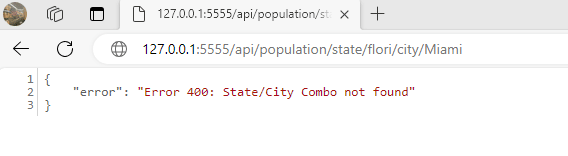

# Trazi Practice Project

This is my service I created in Node.js to participate in the hiring process!


## Authors

- [John Vayianos](https://www.github.com/vcj12)
- [Old account](https://www.github.com/jcv12) (I am having problems currently accessing this. I am in contact with support about it so I created the above github account to make this project)


## Deployment

To deploy this project run

```bash
Make sure MySql is installed on the computer. After that make sure inside the index.js 
file. Insert the port of your sql service with your username and password 
in the appropriate areas

npm install

npm start
```


## Optimizations


In order to expedite the development process, I've decided to consolidate my approach by merging the database schema creation and route control into a single 'index.js' file. This not only streamlines our current workflow but also lays the groundwork for potential future optimizations to enhance performance. I'm also keen on delving deeper into SQL optimizations, including the use of regular expressions and the creation of additional functions to accommodate a wider range of data possibilities, all with the aim of achieving faster and more efficient query results.
## Demo

## Support

For support or questions, email john.charles.vayianos@gmail.com 

